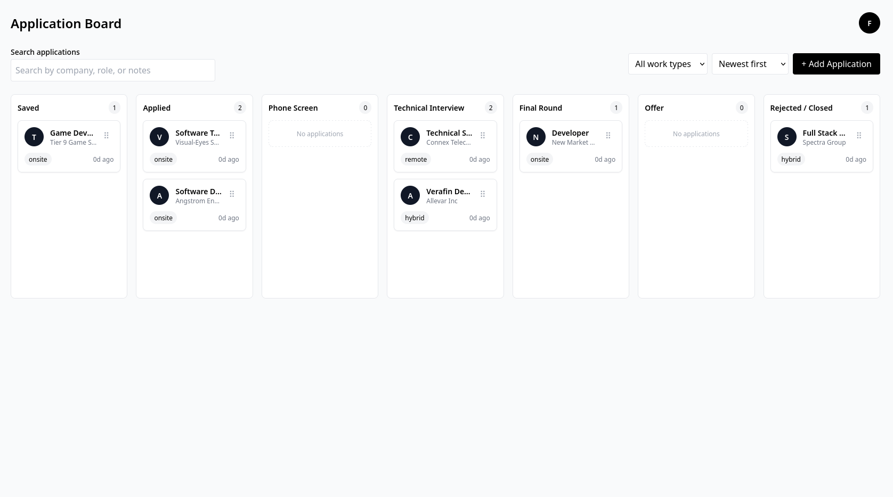
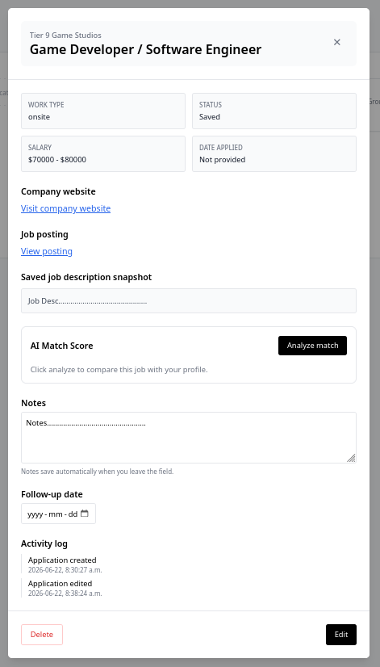
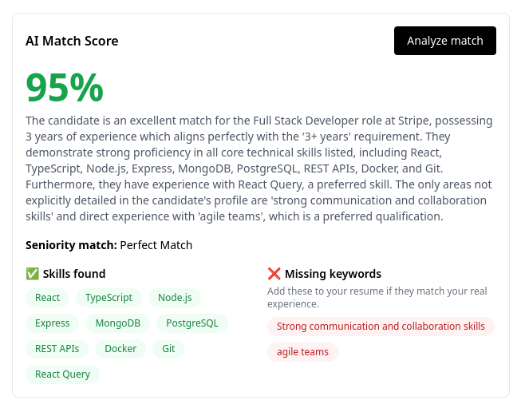

# ApplyPilot

ApplyPilot is a full-stack job application tracker for managing applications in one place.

## Screenshots

### Application Board




### Application Details



### AI Match Score




## Tech Stack

- React
- TypeScript
- Express
- MongoDB
- React Query
- Tailwind CSS
- DnD Kit
- Gemini API

## Running Locally

Backend:

```bash
cd server
npm install
npm run dev
```

Frontend:

```bash
cd client
npm install
npm run dev
```

## Environment Variables

Server:

```env
MONGO_URI=
JWT_SECRET=
CLIENT_URL=
GEMINI_API_KEY=
```

Client: 

```env
VITE_API_URL=
```